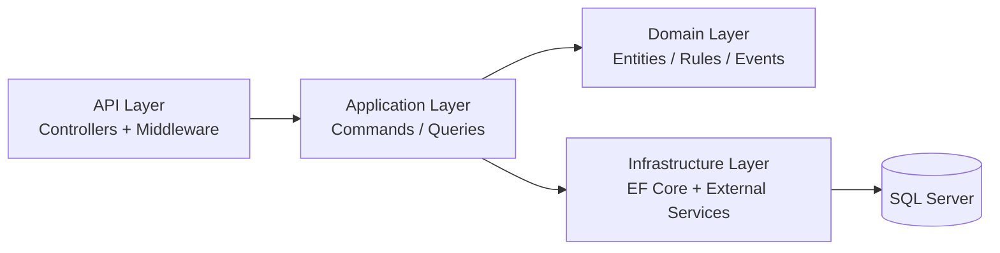

# TowerOps

[](https://github.com/abdallahh166/TowerOps/actions/workflows/dotnet.yml)


TowerOps is a telecom field operations platform by **Seven Pictures** for **subcontractor companies** that execute PM/CM maintenance across tower sites.

It is designed for day-to-day execution by office managers, supervisors, engineers, and controlled client-portal users, with end-to-end coverage for planning, field execution, evidence capture, work order lifecycle, escalation, KPIs, and reporting.

## Table of Contents

- [Product Scope](#product-scope)
- [Core Capabilities](#core-capabilities)
- [Architecture](#architecture)
- [Repository Structure](#repository-structure)
- [Quick Start](#quick-start)
- [Configuration](#configuration)
- [Database and Migrations](#database-and-migrations)
- [API and Testing](#api-and-testing)
- [Documentation](#documentation)
- [Delivery and Operations](#delivery-and-operations)
- [Engineering Rules](#engineering-rules)

## Product Scope

- Product: `TowerOps`
- Company: `Seven Pictures`
- Customer profile: subcontractors that maintain telecom sites
- End client profile: mobile operators and tower companies
- Deployment model: ASP.NET Core API + SQL Server

## Core Capabilities

- Auth, roles, and permission-based policy model
- Sites, offices, users, and assignment operations
- Visit lifecycle with evidence policy and GPS check-in/check-out
- Work order lifecycle with customer acceptance stage
- Escalation lifecycle and approval transitions
- Materials and stock movement (add, reserve, consume)
- Analytics, KPI dashboard, and operational exports
- Excel import/export aligned with real field templates
- Offline sync queue and conflict handling
- Client portal with filtered, read-only operational visibility
- Dynamic system settings and localized error responses (`en-US`, `ar-EG`)

## Architecture

TowerOps follows a Clean Architecture split:

- `TowerOps.Domain`: entities, value objects, domain rules, domain events
- `TowerOps.Application`: use-cases (commands/queries), validators, handlers, DTOs
- `TowerOps.Infrastructure`: EF Core persistence, repositories, external services
- `TowerOps.Api`: HTTP contracts, controllers, middleware, policy wiring



## Repository Structure

```text
.
|- src/
|  |- TowerOps.Api/
|  |- TowerOps.Application/
|  |- TowerOps.Domain/
|  \- TowerOps.Infrastructure/
|- tests/
|  |- TowerOps.Application.Tests/
|  |- TowerOps.Domain.Tests/
|  \- TowerOps.Infrastructure.Tests/
|- docs/
|- tools/
\- TowerOps.sln
```

## Quick Start

### Prerequisites

- .NET SDK 9.x (build/test toolchain)
- SQL Server (local or remote)
- PowerShell or Bash terminal

### Run locally

```bash
dotnet restore
dotnet build TowerOps.sln
dotnet run --project src/TowerOps.Api/TowerOps.Api.csproj
```

In `Development`, Swagger UI is available at:

- `https://localhost:<port>/`

## Configuration

Primary config file:

- `src/TowerOps.Api/appsettings.json`

Required runtime settings:

| Setting | Required | Notes |
|---|---|---|
| `ConnectionStrings:DefaultConnection` | Yes | SQL Server connection string |
| `JwtSettings:Issuer` | Yes | JWT issuer |
| `JwtSettings:Audience` | Yes | JWT audience |
| `JWT_SECRET` (env var) | Production: Yes | Startup guard fails in Production if missing |
| `Settings:EncryptionKey` | Yes | Used for encrypted dynamic settings |
| `Cors:AllowedOrigins` | Yes (Production) | Explicit allowed origins |

Example PowerShell setup:

```powershell
$env:ASPNETCORE_ENVIRONMENT = "Development"
$env:JWT_SECRET = "replace-with-a-strong-secret"
```

## Database and Migrations

Apply migrations:

```bash
dotnet ef database update `
  --project src/TowerOps.Infrastructure/TowerOps.Infrastructure.csproj `
  --startup-project src/TowerOps.Api/TowerOps.Api.csproj
```

Generate idempotent SQL script:

```bash
dotnet ef migrations script --idempotent `
  --project src/TowerOps.Infrastructure/TowerOps.Infrastructure.csproj `
  --startup-project src/TowerOps.Api/TowerOps.Api.csproj `
  --output artifacts/forward-idempotent.sql
```

## API and Testing

Request collection:

- `src/TowerOps.Api/TowerOps.Api.http`

Health endpoint:

- `GET /health`

Run all tests:

```bash
dotnet test TowerOps.sln --logger "console;verbosity=minimal"
```

## Documentation

Authoritative docs index:

- `docs/Documentation-Index.md`

Key docs:

- API surface: `docs/Api-Doc.md`
- Application behaviors: `docs/Application-Doc.md`
- Domain model and rules: `docs/Domain-Doc.md`
- Operational workflow: `docs/Operational-Workflow.md`
- Brand profile: `docs/TowerOps-Brand-Profile.md`
- Production remediation: `docs/phase-2/12-production-remediation-plan.md`
- Observability runbook: `docs/phase-2/13-observability-runbook.md`
- Staging verification: `docs/phase-2/15-staging-smoke-and-rollback-verification.md`

## Delivery and Operations

CI workflow:

- `.github/workflows/dotnet.yml` (restore, build, test, doc drift check)

Release tagging convention (current example):

- `v1.0.0-rc2`

Recommended release gate:

1. Build + tests pass in CI
2. DB migration succeeds on staging
3. Smoke tests pass (`Auth`, `Visits`, `WorkOrders`, `Import`, `Portal`)
4. Go/No-Go signoff documented

## Engineering Rules

- Keep core business logic in `Domain` and `Application`, not controllers.
- Keep migrations additive (no destructive schema changes).
- Preserve policy names and route contracts when extending behavior.
- Update docs when endpoint behavior or lifecycle logic changes.
- Run `python tools/check_doc_drift.py` when modifying API/docs.
