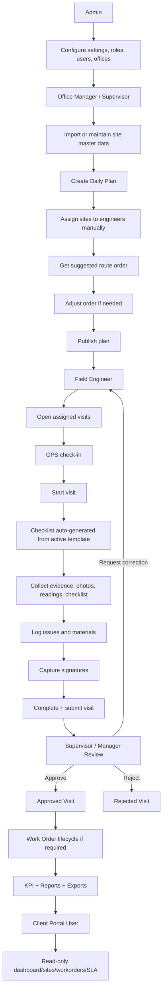
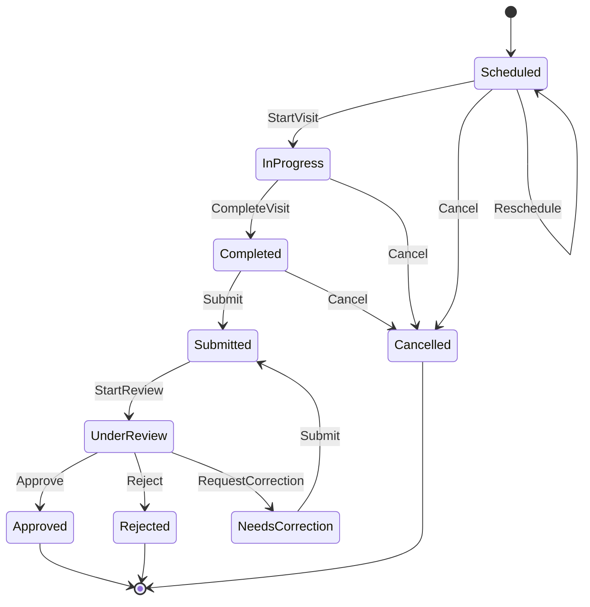
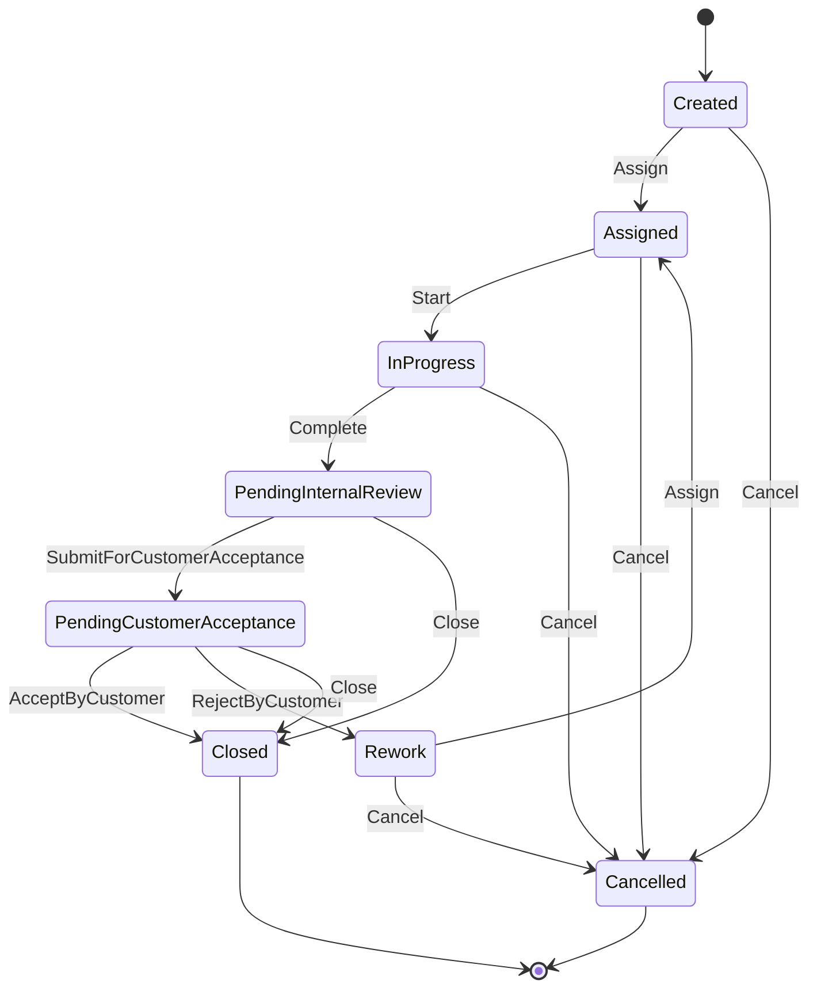
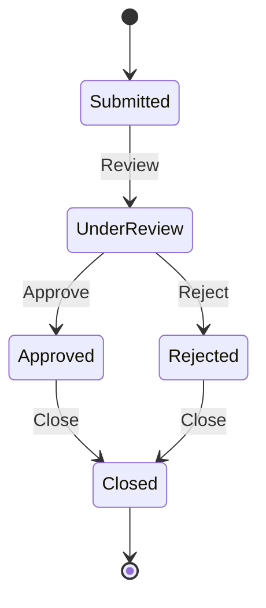
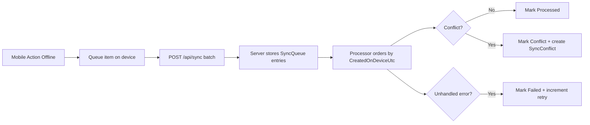

# TowerOps Operational Workflow

This document describes how real users operate TowerOps day to day, with explicit workflow/state diagrams aligned to current implementation.

## 1) Daily User Workflow (Role Interaction)

## 2) Visit Lifecycle State Machine

Notes:
- Check-in/out is tracked with GPS and distance-from-site.
- Suspicious check-in (outside radius) is flagged, not blocked by default.
- Evidence completeness is enforced before submit.

## 3) Work Order Lifecycle State Machine

Notes:
- For equipment-only sites, creating a `TowerInfrastructure` scope work order is blocked.
- Customer acceptance is explicit and auditable.

## 4) Escalation Lifecycle State Machine

## 5) Offline Sync Workflow (Field Reality)

Conflict examples:
- Visit already submitted
- Duplicate photo
- Duplicate reading (server wins)

## 6) Single-Page Swimlane (Training View)

```mermaid
flowchart LR
    subgraph Admin["Admin Lane"]
        A1[Configure system settings]
        A2[Manage roles and permissions]
        A3[Create/invite users]
    end

    subgraph Manager["Office Manager / Supervisor Lane"]
        M1[Import and maintain sites]
        M2[Create daily plan]
        M3[Assign sites to engineers]
        M4[Review suggested route order]
        M5[Publish plan]
        M6[Review submitted visits]
        M7[Create/assign work orders]
        M8[Handle escalations]
        M9[Track KPI and exports]
    end

    subgraph Engineer["Field Engineer Lane"]
        E1[Open assigned visits]
        E2[GPS check-in]
        E3[Start visit]
        E4[Fill checklist and evidence]
        E5[Add readings, photos, issues, materials]
        E6[Capture signatures]
        E7[Complete and submit visit]
        E8[Execute work order]
        E9[Offline sync when connected]
    end

    subgraph Client["Client Portal Lane"]
        C1[View portal dashboard]
        C2[View site status and visits]
        C3[View work order and SLA reports]
    end

    A1 --> A2 --> A3 --> M1
    M1 --> M2 --> M3 --> M4 --> M5 --> E1
    E1 --> E2 --> E3 --> E4 --> E5 --> E6 --> E7 --> M6
    M6 -->|Approved| M7
    M6 -->|Needs correction| E4
    M7 --> E8 --> M8 --> M9
    E9 --> M6
    M9 --> C1 --> C2 --> C3
```

